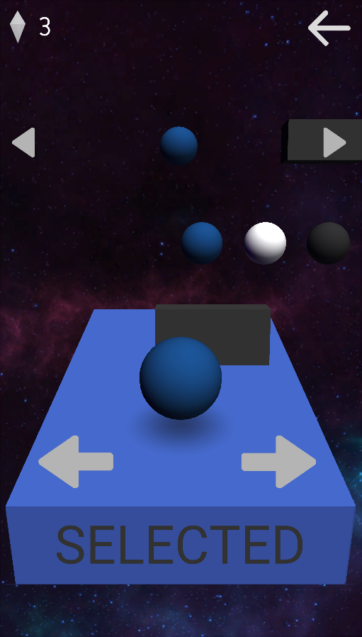
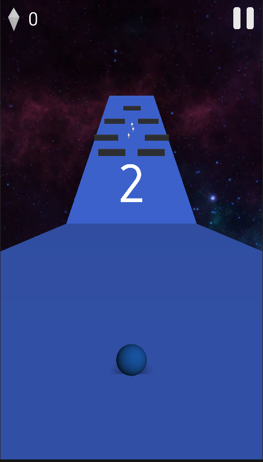

# Rolling Ball

## Description

> This project has written in the years 2017-2018.

This project is a game created using Unity and C#.  
Rolling Ball is a 3D Level based game.  
The player needs to avoid obstacles and collect gems in order to complete levels and unlock new layouts.

## Getting Started

Clone the repo `git clone git@github.com:Refaelbenzvi24/Rolling-Ball.git Rolling-Ball`

and open the folder using unity.

## Screenshots

    
    
    
    
    
    
    

